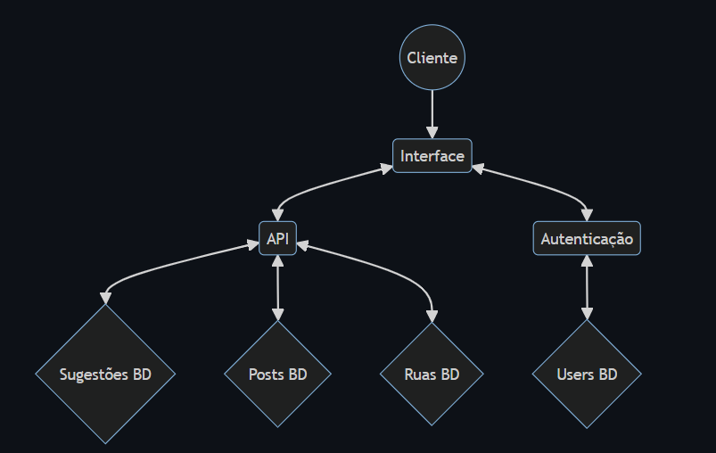

# Projeto Engenharia Web 23/24

### Grupo 8 (Santíssima Trindade)

  - Diogo Pinto Araújo, a100544
  - Hugo António Gomes Ramos, a100644
  - João Gomes Dias de Faria, a100553
  - Tomás Barbosa Oliveira, a100657

# Proposta 3: Mapa das Ruas de Braga

## Índice

1. [Configuração](#configuração)
2. [Tratamento de dados](#tratamento-de-dados)
3. [Scripts](#scripts)
4. [Arquitetura da aplicação](#arquitetura-da-aplicação)
5. [Tipos de utilizadores](#tipos-de-utilizadores)
6. [Funcionalidades](#funcionalidades)
7. [Conclusão](#conclusão)

## Configuração
**Linux/macOS:**
1. Executar o script de povoamento de ruas: `python3 startXMLtoJSON.py`

2. Executar o comando `sudo docker compose up --build -d`

3. Aceder a um browser e pesquisar `http://localhost:3001`

**Windows:**
1. Executar o script de povoamento de ruas: `python3 startXMLtoJSON.py`

2. Executar o comando `docker compose up --build -d`

3. Aceder a um browser e pesquisar `http://localhost:3001`

## Tratamento de dados

Juntamente com os 60 ficheiros .xml e as imagens correspondentes a cada um, fornecidos pela equipa docente, existia um schema.xsd que servia para validar a estrutura dos ficheiros .xml. Aquando da validação, verificamos que 5 ficheiros não eram válidos. Destes inválidos, o ficheiro cujos números de ruas eram 25, 27 e 30
tinham um atributo inválido no campo entidade, sendo alterados para tipo. Já os restantes 2 (43 e 44), faziam referência a uma vista, algo não comportado no schema.

Além das alterações, foram acrescentados os campos freguesia e toponimia. Esta alteração foi acompanhada com uma alteração do schema para representar corretamente estes campos. 

## Scripts

Foi criado um script em python `startXMLtoJSON.py` que inicialmente trata de transformar os ficheiros .xml num ficheiro .json de modo a ser futuramente importado na base de dados contendo todas as ruas iniciais. 

Foi criado um script em python `convertXML.py` que trata de extrair os ficheiros do .zip inserido pelo utilizador com as informações todas de uma rua para uma pasta temporária. Verificamos se existe apenas um ficheiro .xml na pasta e validamos o schema do mesmo. Posteriormente, verificamos a existência das imagens referenciadas no xml e transformando assim, esse ficheiro .xml num .json correspondente àquela rua e sendo este carregado na base de dados.   

## Arquitetura da aplicação
### API

A API corre na porta 3000 e está sempre à espera de receber pedidos para consultar a base de dados. Na pasta models temos o formato em que se encontram os ficheiros na base de dados, na pasta controllers temos definidas as operações que são possíveis de realizar na base de dados e na pasta routes estão definidas todas as rotas capazes de responder a cada pedido.

### Autenticação

A Autenticação corre na porta 3002. No momento de login e registo é consultada a base de dados, de modo a saber se o utilizador já se encontra registado, e se assim for, se as credenciais estão certas. Se isto se verificar, o utilizador terá permissão para aceder às outras interfaces e receberá um token que é guardado nas cookies e utilizado para verificar a cada url inserido pelo utilizador, o username e o nível(consumidor ou administrador). Consoante o nível, o utilizador terá um acesso restrito à aplicação.

### Interface

A Interface corre na porta 3001. É nesta aplicação que são desenvolvidas todas as interfaces a que o utilizador consegue visualizar e aceder. Esta tem dependências, tanto da API como da Autenticação, uma vez que cada ação efetuada pelo utilizador, terá consequente comunicação com cada uma delas. Na pasta `public` encontramos todas as imagens, tanto antigas como atuais, de cada uma das ruas. 

  

## Tipos de utilizadores

Como referido anteriormente, o nível de um utilizador pode tanto ser `administrador` como `consumidor`. 
- **Administrador-** Tem todas as permissões possíveis dentro da aplicação tais como:
    - Visualizar, editar, adicionar e eliminar ruas;
    - Visualizar e eliminar posts;
    - Alterar permissões e eliminar utilizadores;
    - Visualizar, destacar e eliminar sugestões;

- **Consumidor-** Tem um acesso restrito das funcionalidades da aplicação tais como:
    - Visualizar e consultar ruas;
    - Visualizar e adicionar posts;
    - Visualizar e adicionar sugestões;

## Funcionalidades 

### Login
- O utilizador pode efetuar login com as credenciais previamente registadas.

### Registo
- O utilizador pode efetuar registo inserindo o username, o nome e password.

### Ruas
- Numa tabela, são mostradas todas as ruas existentes com os respetivos número da rua, nome, freguesia e toponímia, sendo estes subjacentes a futuras ordenações ou pesquisas/filtros. Clicando no número da rua, conseguimos obter informações mais detalhada como as imagens, casas e uma descrição da mesma. 

- Um administrador tem também uma interface de edição de rua, onde pode alterar todos os parâmetros da mesma. 

### Posts
- Dentro de uma rua, um utilizador pode visualizar todos os posts feitos relativamente àquela por qualquer utilizador e pode fazer um post. Pode também dar like ou comentar posts feitos por terceiros.

- Dentro de um post, o utilizador que o fez pode editar o mesmo.

- Além disso, o utilizador pode ordenar os mesmos por mais recente ou antigo e ainda pesquisar por rua, título ou username de quem fez o post. 

### Sugestões 
- Dentro de uma rua, um utilizador pode fazer uma sugestão acerca daquela rua e esta só pode ser visualizada pelo administrador. Se o administrador gostar da sugestão feita, este pode destacá-la até ser implementada ou removida. 

### Users
- O administrador pode visualizar todos os utilizadores registados e pode alterar o nível do utilizador ou até mesmo apagá-lo.

- Cada user tem a sua página e nesta contém um conjunto de informações como o username, nome, nível e data de criação da conta. Além disso, tem também todos os posts efetuadas pelo utilizador em todas as ruas. 

### Exportar/Importar
- Em qualquer altura, um utilizador com nível de administrador pode exportar o estado completo da aplicação, sendo este guardado na pasta `exportedData` e após várias alterações, se o administrador quiser carregar o estado da aplicação no momento do último backup, basta apenas importar e tudo o que está na pasta `exportedData` é novamente carregado subsituindo as alterações feitas. 

## Conclusão
Para concluir, conseguimos implementar com sucesso todas as funcionalidades pretendidas. Notar apenas que não conseguimos implementar autenticações para além de username e password, como Facebook ou Google devido ao nosso utilizador não possuir um email como campo e também pela complexidade associada. 

Infelizmente, este é um projeto universitário fechado e não estamos a aceitar contribuições neste momento. Agradecemos o seu interesse e incentivamos que você explore outros projetos de código aberto que aceitam contribuições. Obrigado pela sua compreensão.